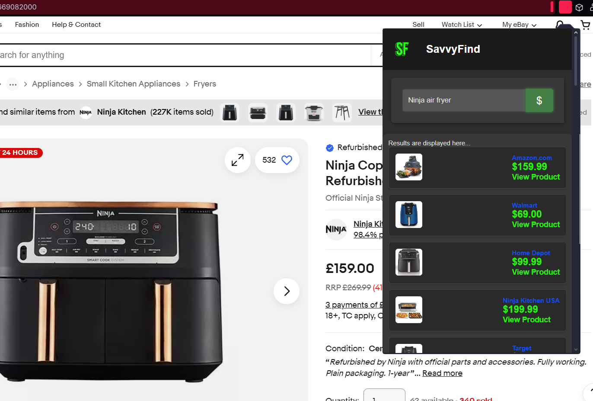

# Price-Comparison-WebExtension
Price-Comparison-WebExtension

//////////////////////////////////////////////////////
//////////////////////////////////////////////////////
THIS IS RUNNING OFF MY PERSONAL API KEY FOR FREE,
SO AFTER USE, EVERYONE WILL HAVE TO CHANGE IT!
SERPAPI(FREE API) IVE ALREADY CREATED A JS
THE API KEY IN popup.js
//////////////////////////////////////////////////////
//////////////////////////////////////////////////////

Unlock the best deals with this open-source web extension that **compares prices** of items across multiple online retailers.

### Features:
- **Unique, colorful UI**: Vibrant and eye-catching interface.
- **Smooth rounded corners**: Modern design for both the base and buttons.
- **Interactive animations**: Enjoyable CSS and JS animations throughout the extension.
- **Price comparison**: Effortlessly compare prices of products from various online stores.

Whether you're browsing or comparing prices, this extension enhances your shopping experience with **delightful animations** and **smooth transitions**, ensuring it's both **practical and visually stunning**.

Never overpay again with this fun, interactive tool designed to save you money!

---

